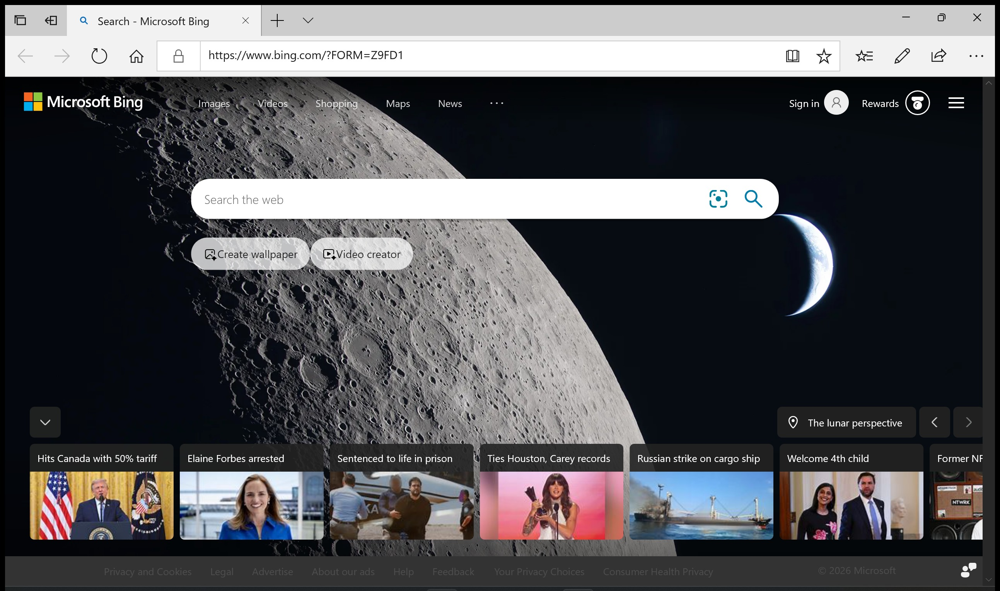
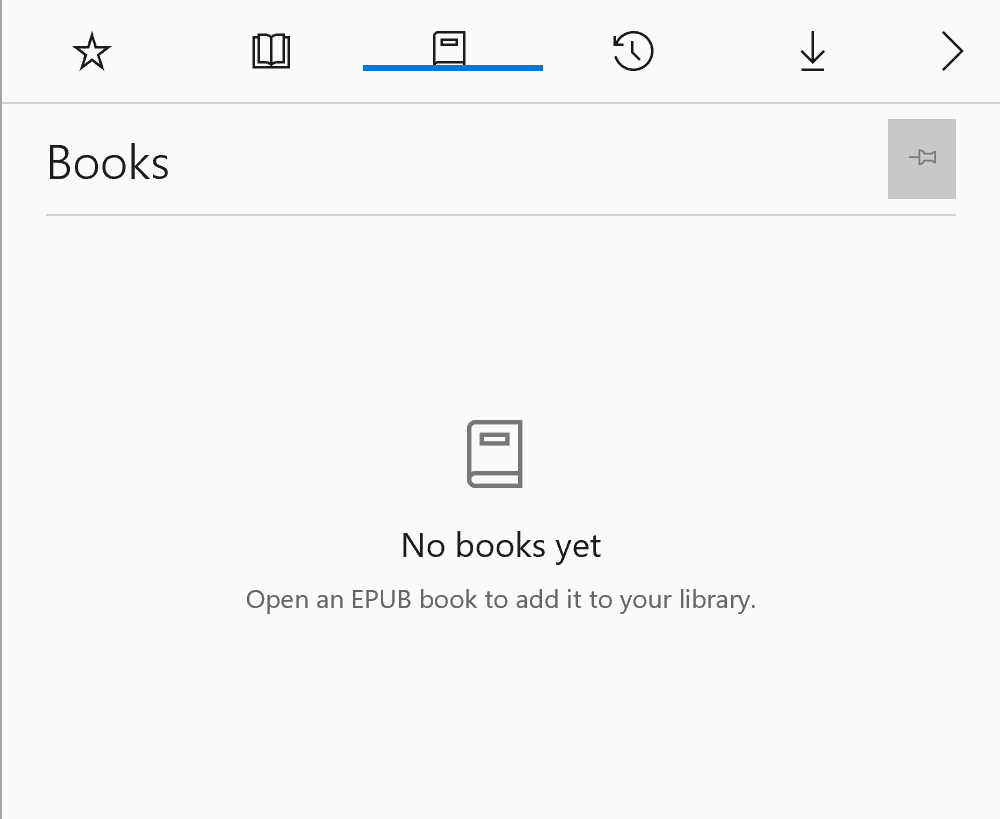
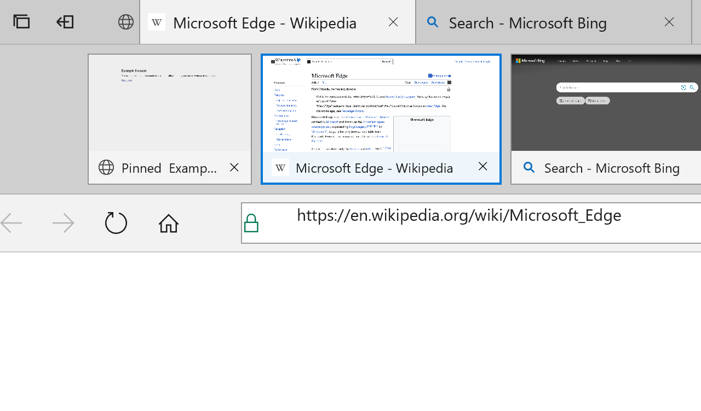
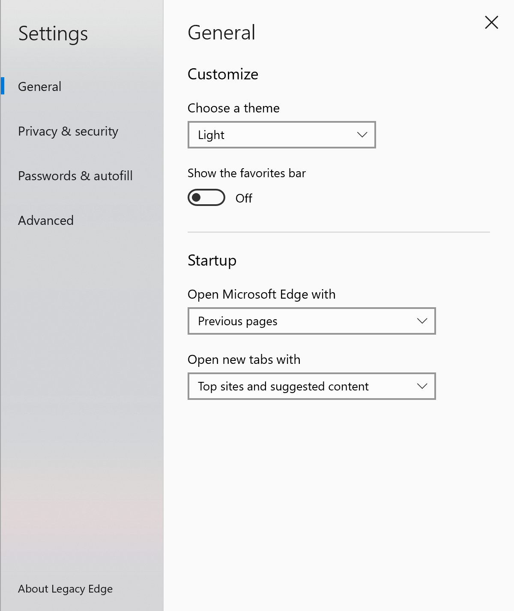
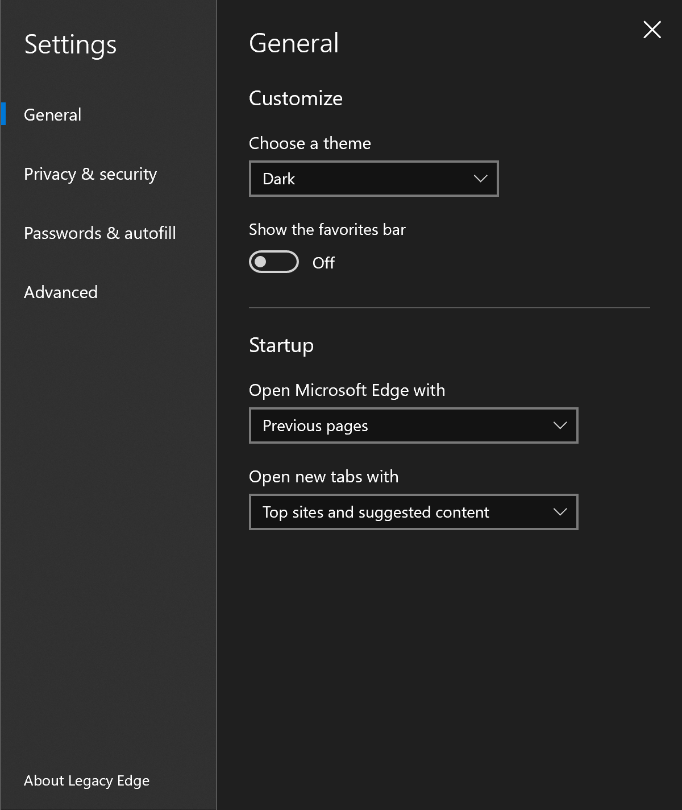
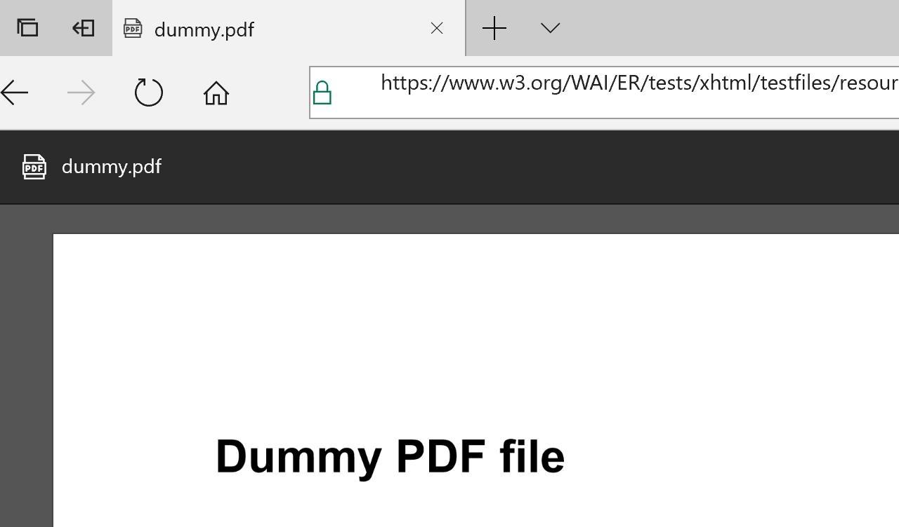

<div align="center">
  
  <h1>Legacy Edge</h1>
  <p><strong>A faithful UWP recreation of Microsoft Edge Legacy, powered by the classic EdgeHTML WebView.</strong></p>
  <p>
    
    
    
    <a href="LICENSE"></a>
  </p>
</div>

Legacy Edge recreates the Windows 10-era Microsoft Edge interface in C# and
XAML. It uses the operating system's `Windows.UI.Xaml.Controls.WebView`, so web
content is rendered by EdgeHTML rather than Chromium or WebView2.

> [!WARNING]
> EdgeHTML is retired and no longer receives browser security updates. Modern
> websites may render incorrectly or fail entirely. Treat this project as a
> compatibility experiment and historical recreation, not as a secure daily
> browser.



## Highlights

- Familiar Edge Legacy chrome with tabs, tab previews, pinned tabs, set-aside
  tabs, recently closed tabs, and drag-to-reorder.
- Back, forward, refresh, home, security information, address-bar search, and
  suggestions from history and favorites.
- Hub views for favorites, reading list, books, history, and downloads.
- Light and dark themes, configurable startup/new-tab behavior, favorites bar,
  session restore, and multi-window browsing.
- Reading view, Read aloud, Web Notes, page sharing, local files, and a built-in
  PDF reader.
- Find on page (`Ctrl+F`, `Enter`, `Shift+Enter`, and `F3`), live-DOM View
  Source, save-page support, and Windows printing.
- Download prompts and progress, connection details, context menus, keyboard
  shortcuts, and an InPrivate-style window mode.

## Screenshots

<table>
  <tr>
    <td width="50%" align="center">
      <br>
      <sub><strong>Compact Hub</strong></sub>
    </td>
    <td width="50%" align="center">
      <br>
      <sub><strong>Tab previews and pinned tabs</strong></sub>
    </td>
  </tr>
  <tr>
    <td width="50%" align="center">
      <br>
      <sub><strong>Light theme</strong></sub>
    </td>
    <td width="50%" align="center">
      <br>
      <sub><strong>Dark theme</strong></sub>
    </td>
  </tr>
</table>

<p align="center">
  <br>
  <sub><strong>Built-in PDF reader</strong></sub>
</p>

## Install a prebuilt package

Release builds use .NET Native, so each developer-install bundle contains one
native architecture. Choose the asset that matches the PC:

| Windows system type | Release asset |
| --- | --- |
| 32-bit Intel or AMD Windows | `LegacyEdge-x86-DeveloperInstall.zip` |
| 64-bit Intel or AMD processor | `LegacyEdge-x64-DeveloperInstall.zip` |
| Windows on ARM with an ARM64 processor | `LegacyEdge-ARM64-DeveloperInstall.zip` |

If the matching asset is not yet listed on the
[Releases page](https://github.com/Generalkidd/LegacyEdge/releases), build and
stage it from source using the instructions below. 32-bit ARM is also a
configured source target, but should be published only after testing on
matching hardware.

1. Enable Developer Mode:
   - Windows 11: **Settings > System > For developers > Developer Mode**
   - Windows 10: **Settings > Update & Security > For developers**
2. Download the matching x86, x64, or ARM64 developer-install ZIP.
3. Extract the **entire ZIP** to a normal, permanent local folder. Do not run
   the installer from File Explorer's compressed-folder view.
4. Close Legacy Edge if it is already running, then double-click `Install.cmd`.
5. Keep the extracted folder in place. It becomes the app's live package
   location; moving, renaming, or deleting it will break the registration.

The installer reads the included manifest, verifies that its architecture
matches Windows, and validates the actual identity of every included dependency
package. It then adds the matching .NET Native and Visual C++ runtimes when
necessary. Installing a newer build through `Install.cmd` preserves favorites,
history, settings, and session data by default.

You can run the same installer from PowerShell and suppress the automatic
launch:

```powershell
.\Install.ps1 -NoLaunch
```

To uninstall Legacy Edge for the current user, run:

```powershell
.\Uninstall.ps1
```

Uninstalling removes the app's local data. Running
`.\Install.ps1 -ResetApplicationData` also deliberately erases that data before
reinstalling.

> [!IMPORTANT]
> Developer Mode permits loose development-package registration; it does not
> make an unsigned `.msix` installable by double-clicking it. Use the complete
> developer-install bundle or deploy directly from Visual Studio.

## Build from source

### Requirements

- Runtime target: Windows 10 version 1809 (build 17763) or newer, including
  Windows 11.
- Build host: a 64-bit Windows version supported by the installed Visual Studio
  2022 release.
- Visual Studio 2022. Version 17.14 is known to work.
- **Universal Windows Platform development** workload/UWP support.
- Windows 10 SDK **10.0.19041.0**.
- The .NET Native toolchain and matching native build tools for the target
  architecture. Release builds use .NET Native even though the application
  source is C#.
- Internet access for the first NuGet restore of
  `Microsoft.NETCore.UniversalWindowsPlatform` 6.2.14.

If the UWP workload is not shown as a single option in Visual Studio Installer,
open **Modify > Individual components** and make sure these components are
present:

- Universal Windows Platform support and UWP .NET tools
- Windows 10 SDK (10.0.19041.0)
- .NET Native
- MSVC v143 x64/x86 tools for x86 and x64 builds
- MSVC v143 ARM/ARM64 tools for ARM and ARM64 builds

You do not need to install an older Visual Studio release. Visual Studio 2022
with the components above builds this project successfully.

### Visual Studio

1. Clone the repository and open `LegacyEdge.sln` in Visual Studio 2022.
2. Choose `Debug` or `Release` and the architecture that matches the target PC.
3. Select **Local Machine** as the deployment target.
4. Use **Build > Build Solution** to compile, or press `F5` to build, register,
   and launch the app. Developer Mode must be enabled for local deployment.

`Release` builds take longer because Visual Studio performs .NET Native
compilation.

### Command line

Run these commands from **Developer PowerShell for VS 2022** in the repository
root. This is a classic UWP project, so use Visual Studio's `msbuild` rather
than `dotnet build`.

```powershell
# Valid values: x86, x64, ARM, ARM64
$platform = "x64"
$configuration = "Release"

msbuild .\LegacyEdge.sln /restore /m `
  /p:Configuration=$configuration /p:Platform=$platform
```

Generated packages are placed under `LegacyEdge/AppPackages/`. Package signing
is disabled in the project, so the resulting MSIX is unsigned.

### Configurations

| Platform | Debug | Release | Current validation |
| --- | :---: | :---: | --- |
| x86 | Yes | Yes | Release build and developer bundle verified; installation requires matching 32-bit test hardware |
| x64 | Yes | Yes | Release build and developer bundle verified |
| ARM | Yes | Yes | Configured; requires matching test hardware |
| ARM64 | Yes | Yes | Release build, developer bundle, install, and launch verified |

### Stage a developer installer

After a Release build, the repository helper derives the architecture and
version from the generated MSIX, validates the matching dependency packages,
and creates the certificate-free loose installer described above:

```powershell
$platform = "x64" # Or ARM64, x86, or ARM
$version = "1.0.0.0" # Match the version in Package.appxmanifest
$packageRoot = ".\LegacyEdge\AppPackages\LegacyEdge_${version}_${platform}_Test"

.\tools\BuildDeveloperInstall.ps1 `
  -PackagePath "$packageRoot\LegacyEdge_${version}_${platform}.msix" `
  -DependencyDirectory "$packageRoot\Dependencies" `
  -OutputDirectory ".\dist\LegacyEdge-${platform}-DeveloperInstall" `
  -ReplaceOutput
```

The helper accepts Release packages for x86, x64, ARM, and ARM64 and rejects
Debug packages or mismatched dependencies. Distribute the complete output
directory as a ZIP; the extracted directory becomes the live installed package
location.

## Project layout

| Path | Purpose |
| --- | --- |
| `LegacyEdge/` | C# UWP application, XAML UI, assets, models, and services |
| `Installer/` | Loose-package install and uninstall templates |
| `tools/BuildDeveloperInstall.ps1` | Stages an architecture-specific developer installer |
| `tools/GenerateAssets.ps1` | Regenerates the application image assets |
| `docs/screenshots/` | Images used by this README |

## Known limitations

- EdgeHTML compatibility is frozen; many modern sites require newer browser
  APIs, TLS behavior, or JavaScript features.
- Standard web-page printing creates one printable page from the currently
  visible viewport. PDF printing is handed to the installed default PDF app.
- InPrivate mode omits this app's history and session restore, but it cannot
  provide complete profile isolation from the operating system's EdgeHTML
  storage. Favorites and downloads are still saved.
- Saved-password integration and persistent form-autofill storage are not
  available. Some security and privacy behavior remains controlled by Windows.
- Release/.NET Native packages are architecture-specific. The installer
  deliberately requires a native host/payload match instead of relying on CPU
  emulation.

## Contributing

Issues and pull requests are welcome. When changing the UI, please test both
themes, narrow and wide window sizes, and at least one x64 or ARM64 Debug build.
Release changes should also receive a matching .NET Native build.

## License and attribution

Released under the [MIT License](LICENSE).

This is an independent, unofficial recreation. Microsoft, Windows, Microsoft
Edge, and their logos are trademarks of Microsoft Corporation. This project is
not affiliated with or endorsed by Microsoft.
